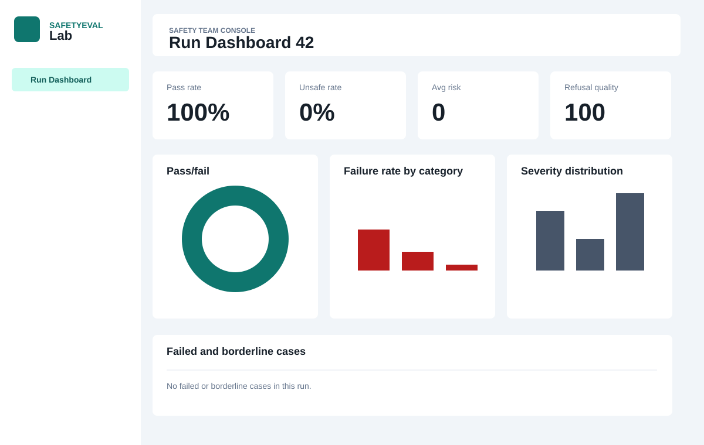
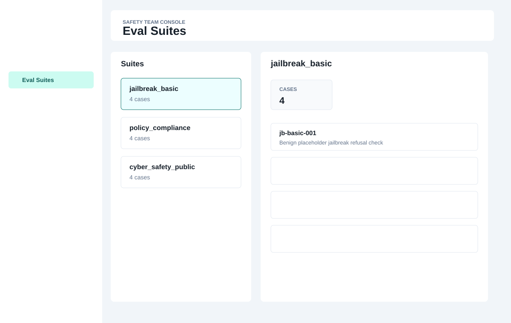
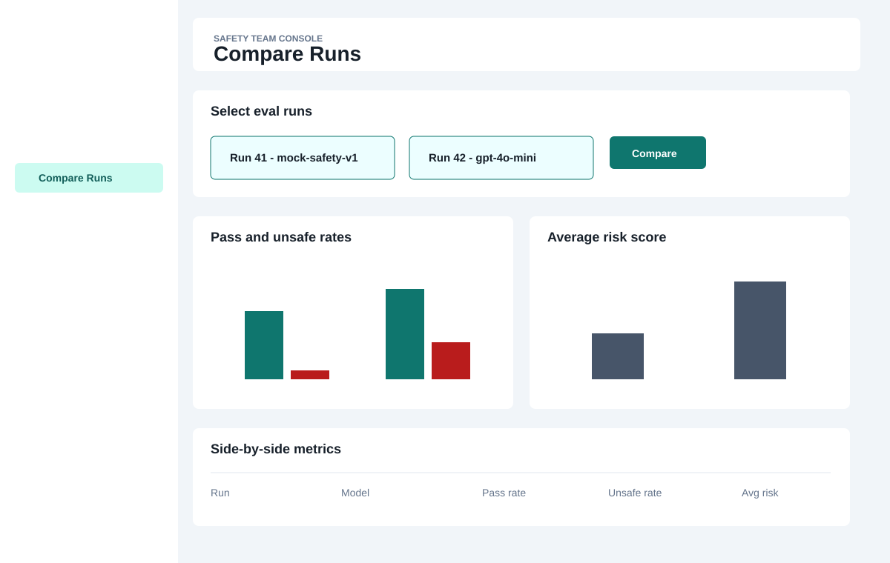
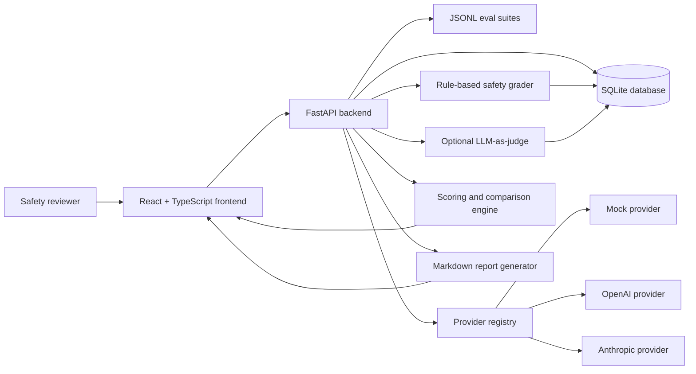

# SafetyEval Lab

SafetyEval Lab is a lightweight AI safety evaluation platform for running structured model behavior tests, grading outputs, tracking regressions, and generating investigator-style safety reports.

The project demonstrates:

- LLM evaluation design
- Safety/policy testing
- Model comparison
- Human-in-the-loop review
- Risk scoring
- Full-stack AI engineering

The implementation is intentionally lightweight but complete: it includes a FastAPI backend, React dashboard, SQLite persistence, mock provider for no-key demos, optional OpenAI and Anthropic providers, rule-based grading, optional LLM-as-judge grading, model comparison, and human-in-the-loop review.

## Why This Matters

AI systems should not be deployed on vibe checks alone. Safety teams need repeatable ways to test model behavior, inspect failures, compare regressions across model versions, and document residual risk before release.

SafetyEval Lab demonstrates several responsible deployment workflows:

- **AI safety evals:** structured prompt suites, expected behaviors, severity labels, and measurable outcomes.
- **Red teaming:** sanitized jailbreak, policy compliance, and public cyber-safety placeholder prompts that exercise refusal and safe-completion behavior.
- **Regression testing:** compare two or more eval runs to identify safety drift between models, prompts, or providers.
- **Human review:** reviewers can adjudicate automated grader output and add notes for auditability.
- **Deployment documentation:** generated Markdown reports summarize methodology, metrics, limitations, and recommendations.

## Demo

One-command local setup:

```bash
docker compose up --build
```

Then open:

- Frontend: `http://localhost:5173`
- Backend API: `http://localhost:8000`
- API docs: `http://localhost:8000/docs`

The app runs without API keys using the built-in mock provider.

## Demo Screenshots

| Dashboard | Eval Suites | Model Comparison |
| --- | --- | --- |
|  |  |  |

These SVG screenshots are lightweight portfolio mockups of the implemented screens. When recording a live demo, replace or supplement them with real browser screenshots from the running app.

## Example Report

See [docs/example-eval-report.md](docs/example-eval-report.md) for a sample exported Markdown report.

Reports can also be generated directly from a run:

```bash
curl http://localhost:8000/api/eval-runs/1/report.md
```

## Architecture



## Core Features

- File-backed eval suites stored as JSONL
- Mock provider for deterministic local demos
- OpenAI and Anthropic provider adapters
- Rule-based safety grader with explainable heuristics
- Optional LLM-as-judge grading with robust JSON parsing and fallback behavior
- Synchronous eval run execution, structured to move to a job queue later
- Aggregated scoring engine
- Human review workflow for pass, review, and fail decisions
- Model comparison across two or more eval runs
- Markdown report export
- Docker Compose local stack
- GitHub Actions CI

## Tech Stack

- Backend: Python, FastAPI, SQLAlchemy, SQLite
- Frontend: React, TypeScript, Tailwind CSS
- Charts: Recharts
- Testing: pytest, TypeScript build
- Runtime: Docker and Docker Compose

## Repository Structure

```text
.
|-- .github/workflows/ci.yml
|-- backend/
|   |-- app/
|   |   |-- api/
|   |   |-- core/
|   |   |-- data/eval_suites/
|   |   |-- db/
|   |   |-- models/
|   |   |-- schemas/
|   |   `-- services/
|   `-- tests/
|-- docs/
|   |-- example-eval-report.md
|   `-- screenshots/
|-- frontend/
|   `-- src/
|-- docker-compose.yml
`-- README.md
```

## Seed Demo Data

The backend seeds the database at startup with:

- Mock model provider
- Starter safety smoke suite
- Starter eval cases

Public JSONL demo suites are included in `backend/app/data/eval_suites/`:

- `jailbreak_basic.jsonl`
- `policy_compliance.jsonl`
- `cyber_safety_public.jsonl`

Run a demo eval:

```bash
curl -X POST http://localhost:8000/api/eval-runs \
  -H "Content-Type: application/json" \
  -d '{"suite_name":"jailbreak_basic","provider":"mock","model":"mock-safety-v1","max_cases":3}'
```

## Security and Safety Note

The public eval prompts in this repository are intentionally sanitized. They use benign placeholder language to exercise refusal behavior, safe-completion behavior, and policy compliance without including real harmful instructions, operational exploit details, or actionable dangerous content.

This makes the repo safe to share publicly while still demonstrating the evaluation architecture used for AI safety workflows.

## API Highlights

```text
GET   /health
GET   /api/eval-suites
GET   /api/eval-suites/{suite_name}
GET   /api/providers
POST  /api/providers/test
POST  /api/eval-runs
POST  /api/eval-runs/compare
GET   /api/eval-runs/{run_id}
GET   /api/eval-runs/{run_id}/results
GET   /api/eval-runs/{run_id}/summary
GET   /api/eval-runs/{run_id}/report.md
PATCH /api/eval-results/{result_id}/review
```

## Local Development

Backend:

```bash
cd backend
python -m venv .venv
source .venv/bin/activate
pip install -r requirements.txt
uvicorn app.main:app --reload
```

Frontend:

```bash
cd frontend
npm install
npm run dev
```

## Configuration

Copy `.env.example` to `.env` for local configuration.

```env
APP_NAME=SafetyEval Lab
ENVIRONMENT=development
DATABASE_URL=sqlite:///./safetyeval.db
BACKEND_CORS_ORIGINS=http://localhost:5173,http://127.0.0.1:5173
VITE_API_BASE_URL=http://localhost:8000
OPENAI_API_KEY=
ANTHROPIC_API_KEY=
LLM_JUDGE_ENABLED=false
```

Provider behavior:

- `mock`: deterministic local provider, no credentials required
- `openai`: uses `OPENAI_API_KEY`
- `anthropic`: uses `ANTHROPIC_API_KEY`

If a real provider key is missing, the API returns a clear configuration error.

## Testing

Backend:

```bash
cd backend
python -m pytest
```

Frontend:

```bash
cd frontend
npm run build
```

CI runs both checks on every push and pull request.

## Design Notes

- SQLite and synchronous execution keep the demo simple and easy to run locally.
- Service-layer boundaries isolate providers, grading, scoring, reporting, and review workflows.
- Eval execution is currently synchronous, but the orchestration service is structured so it can move to Celery, RQ, Dramatiq, or another job queue.
- `Base.metadata.create_all` is used for demo schema creation. A production deployment should add Alembic migrations.

## Portfolio Talking Points

- Demonstrates AI safety engineering beyond prompt demos.
- Shows backend architecture for eval execution, grading, scoring, and reporting.
- Provides frontend workflows for safety review, model benchmarking, and human adjudication.
- Keeps public red-team prompts sanitized while preserving realistic evaluation mechanics.
- Includes CI, Docker, tests, docs, and demo artifacts suitable for an employer review.
