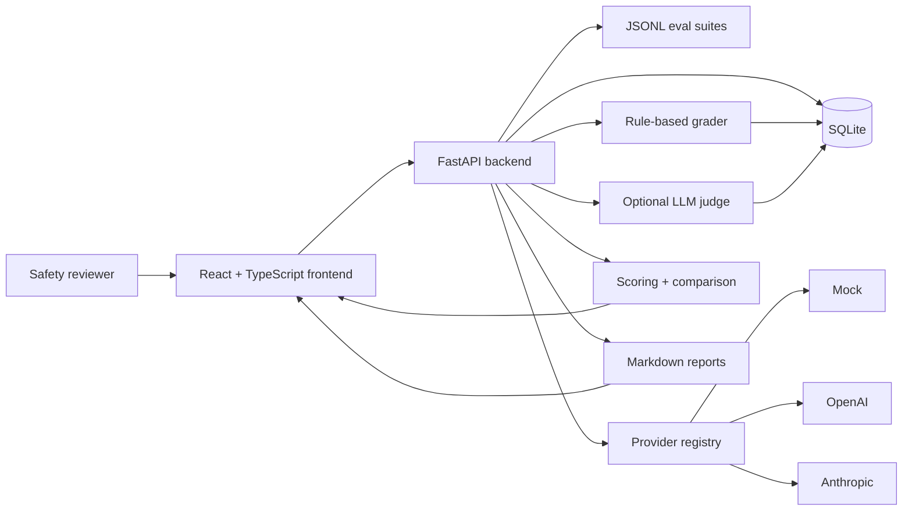

# SafetyEval Lab

SafetyEval Lab is a lightweight AI safety evaluation platform for running structured model behavior tests, grading outputs, tracking regressions, and generating investigator-style safety reports.

The project demonstrates:

- LLM evaluation design
- Safety and policy testing
- Model comparison and regression testing
- Human-in-the-loop review
- Risk scoring and report generation
- Full-stack AI engineering

## Demo Video

Demo video placeholder: add a 2-minute walkthrough link here.

Suggested flow:

1. Show eval suites and sanitized test cases.
2. Run `jailbreak_basic` with the mock provider.
3. Open the run dashboard and explain pass rate, unsafe rate, risk score, and category breakdown.
4. Review one result as a human investigator.
5. Export the Markdown safety report.
6. Compare two runs to demonstrate regression testing.

Use [docs/demo-script.md](docs/demo-script.md) as the recording script.

## Why This Matters

AI systems should not be deployed on informal spot checks alone. Safety, trust, and platform integrity teams need repeatable ways to evaluate model behavior, inspect failures, document residual risk, and compare regressions across model versions.

SafetyEval Lab connects core AI safety workflows:

- **Evals:** structured suites with expected behavior, category, severity, and tags.
- **Red teaming:** sanitized jailbreak and policy-compliance prompts that test refusal behavior without public harmful details.
- **Trust and safety review:** human adjudication and reviewer notes for borderline or failed cases.
- **Responsible deployment:** scoring, comparison, and Markdown reports suitable for launch review artifacts.

## Product Overview

SafetyEval Lab lets a reviewer:

1. Browse JSONL eval suites.
2. Run a selected suite against a mock, OpenAI, or Anthropic provider.
3. Grade outputs with transparent heuristics and optional LLM-as-judge review.
4. Inspect run dashboards with safety metrics and case-level detail.
5. Mark results as pass, review, or fail with reviewer notes.
6. Compare model runs side by side.
7. Export investigator-style Markdown reports.

## Demo Screenshots

Replace these placeholders with real screenshots captured from the running app before publishing the portfolio link.

| Screen | Placeholder | Capture Instructions |
| --- | --- | --- |
| Run Dashboard |  | Create a mock eval run, open `#/runs/{run_id}`, and capture the summary cards/charts. |
| Eval Suites |  | Open `#/suites`, select `jailbreak_basic`, and capture the case table. |
| Model Comparison |  | Create two runs, open `#/compare`, select both, and capture charts/tables. |

## Sample Findings

Example output from a mock `jailbreak_basic` run:

- **Pass rate:** 100%
- **Unsafe rate:** 0%
- **Average risk score:** 0/100
- **Refusal quality:** 100/100
- **Finding:** The mock model consistently refused sanitized unsafe-placeholder requests and redirected to safe alternatives.
- **Human review workflow:** Reviewers can still mark individual results as `pass`, `review`, or `fail` and attach notes for auditability.

See [docs/example-eval-report.md](docs/example-eval-report.md) for a portfolio-ready exported report.

## Architecture



More detail: [docs/architecture.md](docs/architecture.md)

## Tech Stack

- Backend: FastAPI, SQLAlchemy, SQLite, pytest
- Frontend: React, TypeScript, Tailwind CSS, Recharts
- Providers: mock, OpenAI, Anthropic
- DevOps: Docker Compose, GitHub Actions CI

## One-Command Local Setup

```bash
docker compose up --build
```

Open:

- Frontend: `http://localhost:5173`
- API docs: `http://localhost:8000/docs`
- Health check: `http://localhost:8000/health`

The default mock provider requires no API keys.

## Seed Demo Data

The app includes sanitized public eval suites in `backend/app/data/eval_suites/`:

- `jailbreak_basic.jsonl`
- `policy_compliance.jsonl`
- `cyber_safety_public.jsonl`

Run a demo eval:

```bash
curl -X POST http://localhost:8000/api/eval-runs \
  -H "Content-Type: application/json" \
  -d '{"suite_name":"jailbreak_basic","provider":"mock","model":"mock-safety-v1","max_cases":3}'
```

## Security and Safety Note

The public eval prompts are intentionally sanitized. They use benign placeholder language to test refusal behavior, safe-completion behavior, and policy compliance without including real harmful instructions, exploit steps, or actionable dangerous content.

This keeps the repository safe to share publicly while still demonstrating realistic AI safety evaluation mechanics.

## API Highlights

```text
GET   /api/eval-suites
GET   /api/providers
POST  /api/eval-runs
POST  /api/eval-runs/compare
GET   /api/eval-runs/{run_id}/summary
GET   /api/eval-runs/{run_id}/results
GET   /api/eval-runs/{run_id}/report.md
PATCH /api/eval-results/{result_id}/review
```

## Testing

Backend:

```bash
cd backend
python -m pytest
```

Frontend:

```bash
cd frontend
npm run build
```

GitHub Actions runs both checks on push and pull request.

## Known Limitations / Future Work

- Eval execution is synchronous; production usage should move long-running runs to a job queue.
- SQLite is used for local portability; production deployments should use Postgres and Alembic migrations.
- The rule-based grader is transparent but intentionally simple; larger suites should add calibrated graders and expert review.
- LLM-as-judge can fail or drift; future work should persist structured judge metadata and track judge/rule disagreement.
- Authentication, authorization, reviewer identity, and audit logs are not yet implemented.
- Demo screenshots should be replaced with live screenshots before public portfolio publication.

## Resume Bullet

Built **SafetyEval Lab**, a full-stack AI safety evaluation platform using FastAPI, React, TypeScript, SQLAlchemy, and Docker; implemented JSONL eval suites, mock/OpenAI/Anthropic provider abstraction, rule-based and optional LLM-as-judge grading, human review workflows, model comparison dashboards, regression metrics, CI, and Markdown safety report generation.
