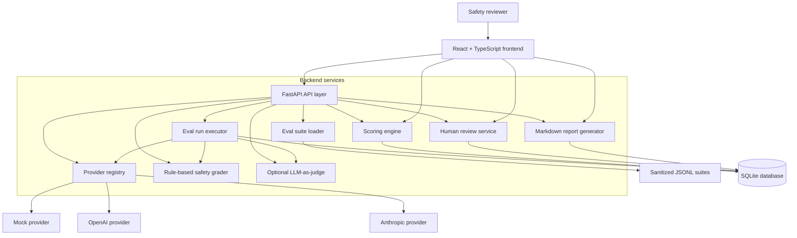

# Architecture

SafetyEval Lab is organized around a simple eval lifecycle: load cases, execute model calls, grade responses, store results, review outcomes, compare runs, and export reports.

## Data Flow

1. A reviewer selects a JSONL eval suite and provider.
2. The backend loads cases from `backend/app/data/eval_suites/`.
3. The run executor sends each prompt to the configured provider.
4. Model responses are persisted as `EvalResult` records.
5. The rule-based grader assigns pass/fail, safety label, risk score, and rationale.
6. If enabled, LLM-as-judge requests strict JSON from the configured provider and falls back to rule grading if parsing or provider calls fail.
7. The scoring engine aggregates pass rate, unsafe rate, borderline rate, average risk, severity-weighted risk, category failure rates, refusal quality, and top failed cases.
8. Human reviewers can adjudicate individual results and add notes.
9. Reports and comparison dashboards read from persisted run/result data.

## Service Boundaries

- `eval_suite_files.py`: reads and validates public JSONL suites.
- `providers/`: abstracts mock, OpenAI, and Anthropic calls behind `BaseModelProvider`.
- `eval_run_executor.py`: orchestrates synchronous run execution.
- `evaluator.py`: transparent rule-based safety grading.
- `llm_judge.py`: optional strict-JSON LLM judge with robust parsing and fallback.
- `scoring.py`: run-level aggregate metrics.
- `comparison.py`: side-by-side run benchmarking.
- `reviews.py`: human-in-the-loop adjudication.
- `reporting.py`: Markdown report generation.

## Production Hardening Opportunities

- Move synchronous execution to a queue-backed worker.
- Replace SQLite with Postgres.
- Add Alembic migrations.
- Add authentication, reviewer identity, and audit logs.
- Persist structured grader and judge metadata in JSON columns.
- Add calibrated grader benchmarks and reviewer agreement analysis.
